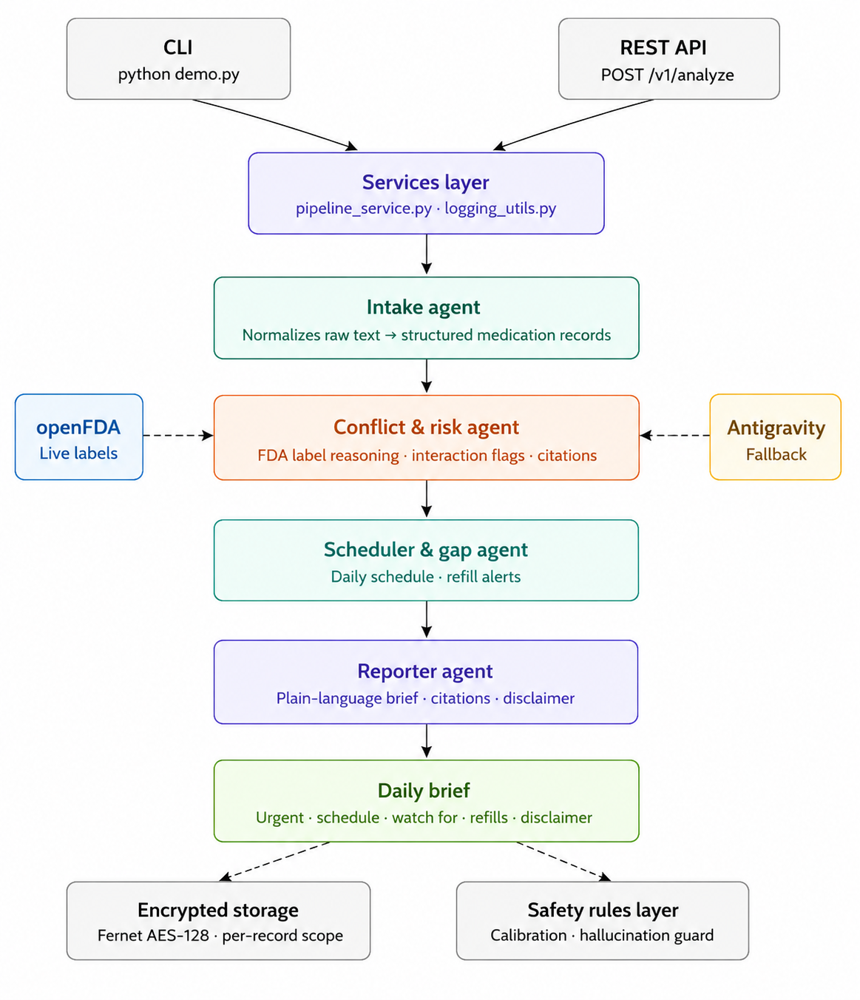

# MedGuard 🛡️
### AI-Powered Medication Safety Assistant


> **Kaggle 5-Day AI Agents Capstone** | Track: Concierge Agents | Built with Google ADK + Gemini 2.5 Flash

MedGuard is a production-ready multi-agent AI system that helps patients and
family caregivers manage complex medication lists safely. It analyzes a full
medication list, checks for dangerous drug interactions using live FDA label
data, builds a daily schedule, and flags upcoming refill gaps — all delivered
as one plain-language daily brief.

---

## The Problem

When a patient sees multiple doctors, no single doctor has the full picture
of what that patient is taking. A cardiologist prescribes a blood thinner.
A primary care doctor, unaware, prescribes ibuprofen for joint pain. Those
two drugs together can cause serious internal bleeding. Neither doctor made
a mistake in isolation — the system just has no mechanism to catch the
conflict across prescribers.

This gap falls hardest on two groups: elderly patients managing 5+ medications
across multiple specialists, and family caregivers coordinating care without
any clinical training.

**Why can't a regular script solve this?**
The NIH's RxNav Drug-Drug Interaction API — the obvious first choice — was
discontinued in January 2024. What remains is raw FDA label text: paragraphs
of clinical language per drug. Going from that text to "here is a real
conflict across this patient's full list, explained in plain English, with a
citation" requires reading and reasoning across multiple unstructured documents
simultaneously. That is exactly what an LLM-based agent does well, and what
a traditional script cannot do.

---

## Sample Input & Output

**Input** — typed conversationally, no structured format required:
```
============================================================
  Welcome to MedGuard - Medication Safety Assistant
============================================================

Who are you managing medications for?

> Kyle

Please enter Kyle's medication list below.
Include drug name, dose, frequency, which doctor
prescribed it, days supply, and last fill date if known.

Type DONE on a new line when finished.

From Dr. Smith (cardiologist):
- Warfarin 5mg, once daily in the evening, last filled 25 days ago, 30 day supply

From Dr. Johnson (primary care):
- Ibuprofen 400mg, up to 3 times daily as needed for knee pain
- Lisinopril 10mg, once daily in the morning, last filled 28 days ago, 30 day supply
- Metformin 500mg, twice daily with meals, last filled 20 days ago, 30 day supply
DONE

Analyzing Kyle's medication list...
```

**Output:**
```
============================================================
  MEDGUARD DAILY BRIEF — KYLE
============================================================

Here is your daily medication brief for Kyle:

1.  URGENT
    Contact a pharmacist or doctor TODAY about the following:
    *   **Warfarin and Ibuprofen:** Taking these two medications together significantly increases the risk of serious bleeding. Warfarin is a blood thinner prescribed by Dr. Smith, and Ibuprofen is for pain prescribed by Dr. Johnson. Do not take Ibuprofen until you have spoken to a healthcare professional about this interaction.
    *   **Lisinopril 10mg:** This medication is estimated to run out in 2 days. Please contact Dr. Johnson TODAY for a refill.

2.  TODAY'S SCHEDULE

    **Morning**
    *   Lisinopril 10mg, once daily
    *   Metformin 500mg, with breakfast

    **Afternoon**
    *   No scheduled medications

    **Evening**
    *   Warfarin 5mg, once daily
    *   Metformin 500mg, with dinner

    **Bedtime**
    *   No scheduled medications

    **As Needed**
    *   Ibuprofen 400mg, up to 3 times daily for knee pain. Do not take until you speak to a pharmacist or doctor.

3.  WATCH FOR
    *   🔶 MODERATE **Lisinopril and Ibuprofen:** Taking Lisinopril (for blood pressure) with Ibuprofen (for pain) can potentially affect kidney function, especially if Kyle is elderly, dehydrated, or has existing kidney issues.
        [Source: Lisinopril FDA label -- Drug Interactions]
    *   ⚠️ CRITICAL **Warfarin:** This medication carries a boxed warning for a significant risk of major or fatal bleeding. Regular monitoring by Dr. Smith is essential.
        [Source: Warfarin FDA label -- Boxed Warning]
    *   ⚠️ CRITICAL **Metformin:** This medication carries a boxed warning for lactic acidosis, a rare but serious condition. Risk factors include kidney impairment, certain drugs, age 65+, and excessive alcohol intake.
        [Source: Metformin FDA label -- Boxed Warning]

4.  REFILLS NEEDED SOON
    *   **Warfarin 5mg:** This medication is estimated to run out in 5 days (around July 11, 2026). Contact Dr. Smith for a refill.

5.  DISCLAIMER
    This brief is informational only, based on FDA label data fetched live from api.fda.gov. It is not a substitute for advice from a pharmacist or doctor.

Save this medication list for next time? (yes/no)
> Yes
Record saved.
```

**Returning User**:
```
============================================================
  Welcome to MedGuard - Medication Safety Assistant
============================================================

Who are you managing medications for?
> Kyle

Found a saved record for Kyle.
1. Load saved record
2. Enter a new list

> 1

Loading Kyle's saved medication list...
Analyzing Kyle's medication list...

[Full daily brief appears instantly — no need to retype the list]
```

---

## Architecture


MedGuard runs a 4-agent sequential pipeline using Google ADK:
```
User input (plain text medication list)
               │
               ▼
┌──────────────────────────────┐
│                              │  Normalizes messy conversational input into
│                              │  structured records: name, dose, frequency,
│        Intake Agent          │  prescriber, days supply, last filled.
│                              │  Never asks for more info -- marks missing
│                              │  fields as unknown and processes immediately.
└──────────────┬───────────────┘
               │
               ▼
┌──────────────────────────────┐
│                              |
│    Conflict & Risk Agent     │  Calls get_drug_safety_info tool to
│                              │  pull live FDA label text for every drug.
│ [Tool: get_drug_safety_info] │  Reasons across the FULL list to flag:
│ [Tool: get_drug_research_    │  - Drug-drug interaction risks
│    fallback (Antigravity)]   │  - Timing conflicts
│                              │  - Prescriber blind spots
│                              │  Uses Antigravity as fallback for drugs
│                              │  with no FDA label. Every flag is tagged
│                              │  with severity and label section citation.
└──────────────┬───────────────┘
               │
               ▼
┌──────────────────────────────┐
│   Scheduler & Gap Agent      │  Builds a practical daily schedule respecting
│                              │  timing conflict flags. Calculates refill gaps
│                              │  from days_supply and last_filled date.
└──────────────┬───────────────┘
               │
               ▼
┌──────────────────────────────┐
│       Reporter Agent         │  The ONLY agent whose output the user reads.
│                              │  Synthesizes everything into one short brief
│                              │  with citations, confidence levels, schedule,
│                              │  refill alerts, and hardcoded disclaimer.
└──────────────────────────────┘
```
Each agent has a single responsibility. ADK's `SequentialAgent` handles all
context passing between agents automatically.

---

## Features

### Clinical Safety
- **Drug interaction detection** — reasons over real FDA label text across the full medication list simultaneously, not just pairwise
- **Prescriber blind spot flagging** — explicitly catches conflicts between medications from different doctors who can't see each other's prescriptions
- **Timing conflict detection** — flags medications that shouldn't be taken close together
- **Citations on every flag** — every finding traced to the exact FDA label section (e.g. `[Source: Warfarin FDA label -- Drug Interactions section]`)
- **Confidence levels** — ⚠️ CRITICAL (Boxed Warning), 🔶 MODERATE (Interactions/Warnings), ℹ️ INFORMATIONAL

### Data & Reliability
- **Live FDA data** — fetched fresh from api.fda.gov on every run, never cached or stale. The NIH interaction database was discontinued in 2024; MedGuard reasons over raw FDA label text instead
- **Antigravity fallback** — when openFDA has no label for a drug, the Antigravity managed agent autonomously researches it from multiple authoritative sources. Confirmed working in testing (returned 9,680 chars of research for an unlisted drug)
- **Retry logic with exponential backoff** — transient openFDA API failures are retried automatically
- **Graceful degradation** — if a drug label isn't found, the agent notes the gap explicitly rather than silently skipping it

### Safety Rules Layer
- **Confidence calibration** — deterministic severity escalation rules on top of LLM output. Boxed Warning language always escalates to CRITICAL regardless of what the model assigns
- **Hallucination guard** — flags without a valid FDA label citation are stripped before reaching the user. Every safety claim must be traceable to actual FDA text
- **Disclaimer enforcement** — hardcoded in the Reporter Agent instruction AND enforced in code by `services/pipeline_service.py` as a safety net

### Security
- **Fernet AES-128 encryption at rest** — patient medication lists are never written to disk in plaintext
- **Per-record access scoping** — a caregiver can only decrypt records they are explicitly authorized for. Unauthorized access fails closed with a deliberately vague error
- **PII-safe logging** — patient names are SHA-256 hashed before appearing in any log output. Real names never appear in logs
- **Key via environment variable** — encryption key never hardcoded, never logged, never sent to the LLM
- **Input validation** — all inputs validated before hitting the expensive pipeline

### Observability & Reliability
- **Request ID tracing** — every API request gets a unique ID that flows through all log statements for end-to-end traceability
- **Structured JSON logging** — logs rendered as one JSON object per line for SIEM ingestion (Splunk, Google Cloud Logging). Set `LOG_FORMAT=text` for human-readable local dev output
- **Proper 429 handling** — quota exhaustion returns a clean 429 with a `Retry-After` header rather than a generic 500
- **Health check endpoint** — `GET /healthz` for Cloud Run, load balancers, and monitoring systems

### Interfaces
- **Interactive CLI** — `python demo.py` for direct use
- **REST API** — FastAPI with versioned endpoints, Swagger UI, request tracing
- **Save & load patient records** — medication lists saved encrypted, loaded automatically on next run

### Code Quality
- **67 unit tests** across 3 test files — all passing
- **GitHub Actions CI** — tests run automatically on every push
- **Inline comments throughout** — design decisions and reasoning documented in code
- **Services layer** — shared pipeline logic in `services/pipeline_service.py` used by both CLI and API, ensuring identical behavior across interfaces

---

## Course Concepts Demonstrated

```
|           Concept            |                                        Implementation                                                        |
|------------------------------|--------------------------------------------------------------------------------------------------------------|
| Multi-agent system (ADK)     | 4 agents chained via ADK `SequentialAgent` in `agents/orchestrator.py`                                       |
| MCP-style tool               | `get_drug_safety_info` in `tools/openfda_client.py` wrapping live FDA API                                    |
| Antigravity                  | `tools/antigravity_client.py` — fallback research confirmed working (9,680 chars returned for unlisted drug) |
| Security features            | Fernet AES-128 encryption, per-record access scoping, PII-safe hashed logging                                |
| Deployability                | `Dockerfile` + Cloud Run deployment path documented below                                                    |
```

---

## Setup

### 1. Clone the repo
```bash
git clone https://github.com/BhavishyaMangalasary/MedGuard_ai.git
cd MedGuard_ai
```

### 2. Create virtual environment
```bash
python3 -m venv .venv
source .venv/bin/activate  # Windows: .venv\Scripts\activate
```

### 3. Install dependencies
```bash
pip install -r requirements.txt
```

### 4. Set up environment variables
```bash
cp .env.example .env
```

Edit `.env` with your values:
- `GOOGLE_API_KEY` — free from [Google AI Studio](https://aistudio.google.com/apikey)
- `MEDGUARD_ENCRYPTION_KEY` — generate with:
```bash
python -c "from cryptography.fernet import Fernet; print(Fernet.generate_key().decode())"
```
- `LOG_FORMAT` — set to `text` for human-readable local development logs (default is `json` for production)
- `LOG_LEVEL` — set to `INFO` or `DEBUG` for verbose output during development (default is `WARNING`)

### 5. Run CLI
```bash
python demo.py
```

Type your medication list when prompted. Type `DONE` on a new line when finished.

### 6. Run REST API
```bash
uvicorn api_server:app --reload --port 8080
```

Open **http://127.0.0.1:8080/docs** for the interactive Swagger UI.

---

## API Endpoints

```
|    Endpoint   | Method | Description                                     |
|---------------|--------|-------------------------------------------------|
| `/`           | GET    | Welcome and API info                            |
| `/healthz`    | GET    | Liveness probe for Cloud Run / load balancers   |
| `/v1/analyze` | POST   | Analyze medication list, returns daily brief    |
| `/docs`       | GET    | Interactive Swagger UI                          |
```

**Example request:**
```bash
curl -X POST "http://127.0.0.1:8080/v1/analyze" \
  -H "Content-Type: application/json" \
  -d '{
    "patient_name": "Kyle",
    "medication_text": "From Dr. Smith: Warfarin 5mg once daily. From Dr. Johnson: Ibuprofen 400mg as needed."
  }'
```

---

## Deployment

```bash
gcloud run deploy medguard \
  --source . \
  --region us-central1 \
  --allow-unauthenticated \
  --set-env-vars GOOGLE_API_KEY=your_key \
  --set-env-vars MEDGUARD_ENCRYPTION_KEY=your_key \
  --set-env-vars GOOGLE_GENAI_USE_VERTEXAI=FALSE
```

---

## Project Structure

```
MedGuard_ai/
├── agents/
│   ├── intake_agent.py          # Normalizes raw input into structured records
│   ├── conflict_risk_agent.py   # Flags interactions using FDA data + Antigravity
│   ├── scheduler_gap_agent.py   # Builds schedule, tracks refills
│   ├── reporter_agent.py        # Writes the final daily brief + DISCLAIMER_TEXT
│   ├── orchestrator.py          # Wires all 4 agents via SequentialAgent
│   └── models.py                # Shared data structures (Medication, RiskFlag, etc.)
├── tools/
│   ├── openfda_client.py        # Live FDA label API with retry logic + graceful degradation
│   ├── secure_storage.py        # Fernet-encrypted patient storage with access scoping
│   ├── antigravity_client.py    # Antigravity managed agent fallback research
│   └── safety_rules.py          # Confidence calibration + hallucination guard
├── services/
│   ├── logging_utils.py         # Structured JSON logging + PII-safe patient hashing
│   └── pipeline_service.py      # Shared pipeline logic for CLI and API
├── tests/
│   ├── test_openfda_client.py   # 21 unit tests
│   ├── test_secure_storage.py   # 15 unit tests
│   └── test_safety_rules.py     # 31 unit tests
├── .github/workflows/
│   └── tests.yml                # GitHub Actions CI -- runs on every push
├── api_server.py                # FastAPI REST API with request tracing + 429 handling
├── demo.py                      # Interactive CLI entry point
├── Dockerfile                   # Container for Cloud Run deployment
├── requirements.txt
└── .env.example
```

---

## What MedGuard Does Not Do

- Give medical advice or tell a user to stop or change a medication
- Diagnose any condition
- Replace a pharmacist or doctor
- Claim to be HIPAA-certified infrastructure

Every output includes a clear disclaimer. MedGuard flags patterns for human review only.

---

*Built by Bhavishya for the Kaggle 5-Day AI Agents Capstone with Google.*
